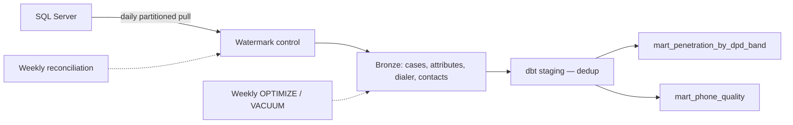

<div align="center">

# Incremental Penetration & Phone Quality Pipeline

**Replacing a full-reload reporting query with watermark-based incremental extraction**

[](https://spark.apache.org)
[](https://delta.io)
[](https://getdbt.com)
[](https://databricks.com)

[](https://github.com/paulopottermarchi/penetration-pipeline/actions/workflows/ci.yml)
[](https://github.com/paulopottermarchi/penetration-pipeline/actions/workflows/e2e.yml)

</div>

---

## The problem

A debt-collection operation ran two recurring reports off a shared production SQL Server: a **dialer penetration report**, segmented by client × provider × DPD band, and a **phone quality report** flagging telecom IDs with high failure rates.

Both were full-reload queries. Every execution re-scanned the entire call log for the reporting window from scratch. As call volume grew, that re-scan got slower and put avoidable load on a database the collection floor depends on during working hours.

This pipeline replaces the re-scan with watermark-based incremental extraction into a Delta lakehouse, running once daily — which already exceeds the freshness the reports are actually consumed at. The improvement it claims is narrow and specific: the same two numbers, produced without reading the same rows again every morning.

> Schema names, client identifiers and business codes in this repository are illustrative. The architecture, the query logic and the failure modes it handles are real.

---

## Architecture

```
SQL Server (read-only application login — no CDC, no sysadmin)
         │
         │  Daily partitioned JDBC pull
         │  WHERE update_date > @last_watermark - lag
         ▼
┌──────────────────────────────────────────────────────┐
│  Databricks Job — one shared cluster, 4 ingest tasks  │
│  cases · case_attributes · dialer · contacts          │
└──────────────────────────────────────────────────────┘
         │
         ▼
┌──────────────────────────────────────────────────────┐
│  BRONZE — append-only change log (Delta)              │
└──────────────────────────────────────────────────────┘
         │
         │  dbt run
         ▼
┌──────────────────────────────────────────────────────┐
│  staging/   deduplicate to latest known state         │
│  marts/     mart_penetration_by_dpd_band              │
│             mart_phone_quality                        │
└──────────────────────────────────────────────────────┘
         │
         ▼
   Power BI
```



---

## Extraction design

No CDC was available — the pipeline runs against a read-only application login on a database it does not own. That constraint shapes everything below.

**Watermark control.** A Delta control table tracks `update_date` per source table. It advances only on success, never backward, and a failed run leaves it exactly where it was, so a retry re-reads the same window rather than skipping it.

**Overlap re-read.** Polling on `update_date` has a blind spot that is easy to miss: if the source stamps `update_date` at transaction start but the commit lands after our read, those rows are already below the watermark next time we look, and they are never picked up. The pipeline rewinds the watermark by a fixed lag on every read. Re-reading a small overlap costs almost nothing and is safe, because the staging layer deduplicates by primary key regardless.

**Parallel reads.** A plain JDBC pull runs through one connection on one executor no matter how large the cluster is. Each source is read with a numeric `partitionColumn` and bounds derived from a cheap `MIN`/`MAX` query, which matters most on the first run — the watermark is still at its seed value, so the predicate matches the whole table.

**One materialisation per batch.** The JDBC DataFrame is lazy: counting it, writing it, and deriving its maximum are three separate executions of the source query. The batch is persisted once and the count and maximum come from a single aggregation, so a daily run costs the source one read per table.

**Reconciliation.** The overlap re-read does not help with rows that change *without* touching `update_date`. A weekly job compares source and Bronze counts per table and **fails** above a drift threshold — a data quality check that only writes to a log nobody reads is not a check.

**Housekeeping.** Bronze is append-only and written daily, so a weekly job runs `OPTIMIZE` with `ZORDER` and `VACUUM`. Without it the marts get slower every week for reasons invisible from the SQL.

---

## Source query → pipeline map

| Source SQL element | Pipeline equivalent |
|---|---|
| Rolling month window | `date_bounds` CTE, computed from `current_date()` |
| Provider attribute type | `stg_case_attributes` pivot |
| DPD attribute type | `stg_case_attributes` pivot |
| DPD band `CASE WHEN ... BETWEEN` | `dpd_faixa` derived column |
| `dialed_cases` CTE | `stg_dialer` aggregated by `case_id` |
| `contact_stats` CTE (Paid / PTP / right-party) | `stg_contacts` + per-case aggregation |
| Exclusion of system-generated contacts | Filtered once in `stg_contacts`, not per query |
| `LEFT JOIN` + `COUNT(dc.case_id)` | Same join, `count()` on the nullable joined column |
| `GROUP BY client, provider, band` | Mart `group by` |

Business codes — client IDs, attribute types, disposition codes, thresholds, window length — are dbt vars in `dbt_project.yml` rather than literals in model SQL. A code that changes at the source is a one-line edit.

---

## What's tested

Watermark: forward-only, unchanged on an empty batch, unchanged on failure, and correctly rewound by the overlap lag. The failure path is covered specifically, since a bug there breaks the error handler and takes the original exception with it.

Extraction: the timestamp guard on the watermark predicate, including injection-shaped input.

Marts: DPD band boundaries at every edge, negative DPD falling through to `Sem DPD` rather than inflating the freshest bucket, `penetration_rate` bounded to [0,1], empty segments returning null instead of failing, and Paid / PTP / right-party behaving as independent buckets rather than exclusive branches.

dbt: `not_null`, `unique`, `accepted_values`, `accepted_range`, and a grain test on both marts — a duplicated segment row silently doubles the Power BI totals.

---

## Repository structure

```
penetration-pipeline/
├── notebooks/
│   ├── bronze/          01–04 incremental ingestion (thin — logic in utils/ingest.py)
│   └── control/         watermark setup · reconciliation · Delta maintenance
├── dbt_project/
│   ├── models/staging/  dedup + pivot
│   ├── models/marts/    the two reports
│   ├── packages.yml     dbt_utils
│   └── dbt_project.yml  business codes as vars
├── utils/
│   ├── jdbc_config.py   partitioned incremental reads
│   ├── watermark_utils.py
│   └── ingest.py        shared ingestion routine
├── dags/                daily · weekly reconciliation · weekly maintenance
├── tests/
└── conftest.py
```

---

## Setup

```bash
databricks secrets create-scope penetration-pipeline
databricks secrets put --scope penetration-pipeline --key sqlserver_host
databricks secrets put --scope penetration-pipeline --key sqlserver_port
databricks secrets put --scope penetration-pipeline --key sqlserver_db
databricks secrets put --scope penetration-pipeline --key sqlserver_user
databricks secrets put --scope penetration-pipeline --key sqlserver_password

# Run once to seed the watermark control table
databricks jobs run-now --notebook notebooks/control/00_watermark_control_setup

databricks jobs create --json-file dags/databricks_job.json
databricks jobs create --json-file dags/databricks_job_reconciliation.json
databricks jobs create --json-file dags/databricks_job_maintenance.json

cd dbt_project && dbt deps && dbt run && dbt test
```

Local test run:

```bash
pip install -r requirements.txt
pytest
```

---

## Run it locally

The pipeline targets Databricks, but it does not need a Databricks workspace to be inspected. `docker-compose.yml` brings up a SQL Server standing in for the source system, seeds it with synthetic data, and runs the pipeline's own ingestion code against it.

```bash
make demo
```

That goes from an empty machine to built, tested marts: schema, synthetic seed, Bronze ingestion, `dbt run`, `dbt test`. Then:

```bash
make query    # sample rows from the penetration mart
make bench    # simulate a day of activity, measure extraction cost
make test     # unit tests
make clean    # tear it all down
```

The local run executes `utils/ingest.py` and the dbt models unchanged. Only two things differ from the Databricks path: credentials come from environment variables rather than a secret scope, and dbt connects through `method: session` instead of `dbt-databricks`. There is no second copy of the extraction logic to drift out of step with the first.

The demo harness uses a Derby-backed metastore, which admits one JVM at a time — hence the sequential targets. That is a property of the stand-in, not of the pipeline.

### Benchmark

`make bench` applies a day of simulated activity to the source, then asks both approaches for the same thing: the rows the report needs. It reports rows read and wall-clock for a full window reload versus an incremental pull.

Rows read is the meaningful figure — it is what crosses between machines. Wall-clock against a containerised SQL Server on a laptop is indicative only, and the output says so. The benchmark is scoped to extraction, because extraction is what the pipeline changed; the marts rebuild fully in both arms.

---

## Continuous integration

Two workflows, on different cadences.

**CI** runs on every push and pull request and finishes in a couple of minutes: `ruff` for undefined names and unused imports, `pytest` for the unit suite, `dbt parse` to resolve every ref, source, var and macro without touching a warehouse, and a scan for committed credentials.

One detail worth naming: the Delta-backed tests skip when the Delta jars cannot be resolved, which is the right behaviour on a laptop and the wrong one in CI — a skip there would mean the watermark guarantees went unverified behind a green tick. The workflow reads the JUnit output and fails if anything was skipped.

**End-to-end** runs on merges to main, weekly, and on request. It executes `make demo` against a real SQL Server: seed, ingest, build, test. Then it runs the whole thing a second time, because a pipeline that claims to be incremental has to be safe to run twice — a second pass should land almost nothing and leave the marts unchanged, and if the watermark or the staging dedup is wrong, that is where it surfaces.

The weekly schedule is deliberate. What rots in a repository like this is external — a base image moves, a pinned version disappears — and it rots on its own schedule rather than when someone happens to push.

### Leak scan

`scripts/leak_scan.py` fails the build on anything shaped like a credential or an internal identifier: corporate email addresses, cloud database hostnames, inline passwords, connection strings with embedded credentials, private keys, cloud access tokens, personal workspace paths.

It matches on shape rather than on a list of values. A deny-list of the actual internal names would be a file that leaks precisely what it exists to prevent.

---

## Author

**Paulo Potter Marchi** — Analytics Engineer → Data Engineer
[GitHub](https://github.com/paulopottermarchi) · LinkedIn: <!-- add your handle -->
